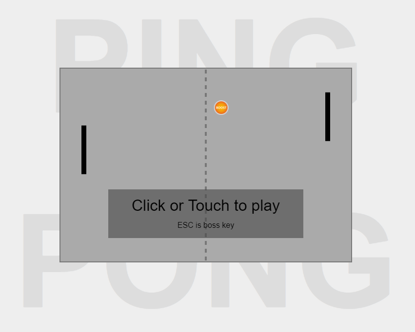

# Ping Pong

JavaScript Ping Pong game base on the Phaser library (https://phaser.io/). A single player can play against the computer AI.

All data (including image information) are contained in the game file. By obfuscation you can combine the game and the library into a single file. 

This game was developed as easter egg and provides boss key functionality. It was developed on an Android tablet with a text editor and Chrome because no other hardware was available at the time.

The game page will only open if the correct query is submitted. Otherwise it is automatically redirected to the application. To start the game, open the index.html in your favorite browser and click on the link.

# Many thanks for your donation!

If you want to support this free project, any help is welcome. You can donate by clicking on one of the following links:

# License

MIT License

Copyright (c) 2021 Martin Gaus

Permission is hereby granted, free of charge, to any person obtaining a copy
of this software and associated documentation files (the "Software"), to deal
in the Software without restriction, including without limitation the rights
to use, copy, modify, merge, publish, distribute, sublicense, and/or sell
copies of the Software, and to permit persons to whom the Software is
furnished to do so, subject to the following conditions:

The above copyright notice and this permission notice shall be included in all
copies or substantial portions of the Software.

THE SOFTWARE IS PROVIDED "AS IS", WITHOUT WARRANTY OF ANY KIND, EXPRESS OR
IMPLIED, INCLUDING BUT NOT LIMITED TO THE WARRANTIES OF MERCHANTABILITY,
FITNESS FOR A PARTICULAR PURPOSE AND NONINFRINGEMENT. IN NO EVENT SHALL THE
AUTHORS OR COPYRIGHT HOLDERS BE LIABLE FOR ANY CLAIM, DAMAGES OR OTHER
LIABILITY, WHETHER IN AN ACTION OF CONTRACT, TORT OR OTHERWISE, ARISING FROM,
OUT OF OR IN CONNECTION WITH THE SOFTWARE OR THE USE OR OTHER DEALINGS IN THE
SOFTWARE.